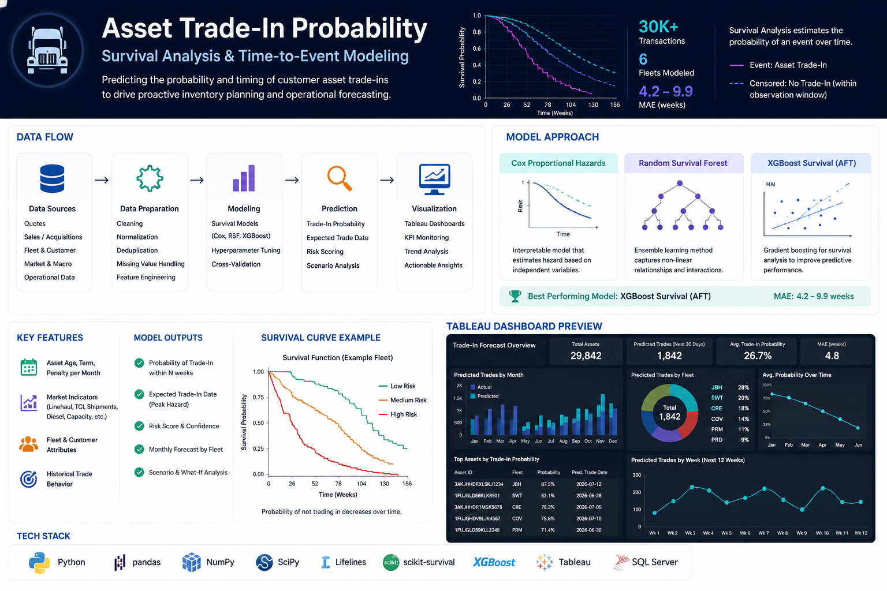

# ⏳ Asset Trade-In Probability Prediction
### Predicting Commercial Asset Trade-In Timing with Survival Analysis

**Author:** Brandy Horne  
**Tech Stack:** Python • Survival Analysis • XGBoost • Lifelines • SQL Server • Tableau • Machine Learning

---

  

---

## 🚀 Project Overview

Organizations managing large commercial asset fleets need to anticipate when customers are likely to trade in equipment in order to optimize inventory, pricing, logistics, and resource planning. Traditional regression models predict *if* an event occurs, but not *when*.

This project applies **Survival Analysis** and machine learning techniques to estimate both the probability and expected timing of customer asset trade-ins. The solution transforms historical operational data into actionable forecasts that support strategic business decisions and long-term planning.

The final model outputs were delivered through interactive **Tableau dashboards**, allowing business users to explore future trade activity by fleet, geography, customer, and asset characteristics.

---

# ⭐ Key Features

- Time-to-event prediction using Survival Analysis
- Kaplan-Meier survival estimation
- Cox Proportional Hazards modeling
- XGBoost Survival Modeling
- Advanced feature engineering
- Fleet-level forecasting
- Tableau executive dashboards
- Business-focused risk segmentation
- Interactive probability forecasting

---

# 🎯 Business Problem

Commercial vehicles often remain in service for many years, making it difficult to predict when customers will replace or trade them. Unexpected trade-ins impact inventory availability, pricing strategy, logistics planning, and revenue forecasting.

The objective of this project was to build a predictive framework capable of estimating both **when** an asset is likely to be traded in and **how likely** that event is to occur within a given time horizon.

---

# 🔍 Business Understanding

Understanding asset replacement behavior required combining multiple operational and business factors including:

- Vehicle age and utilization
- Mileage accumulation
- Lease and financing cycles
- Customer purchasing behavior
- Historical trade patterns
- Market conditions
- Economic indicators

The resulting model needed to provide interpretable predictions that business stakeholders could confidently use for planning and operational decision-making.

---

# 📂 Data Sources

Historical data was integrated from multiple internal systems including:

- Asset inventory records
- Customer information
- Historical trade-in transactions
- Sales history
- Operational metrics
- Market indicators
- Service and maintenance records

Additional engineered features captured long-term ownership behavior and replacement trends.

---

# 🧹 Data Preparation

Significant preprocessing was performed to prepare the dataset for time-to-event modeling.

Activities included:

- Data cleaning
- Missing value treatment
- Feature normalization
- Outlier detection
- Event labeling
- Right-censoring identification
- Feature engineering
- SQL data integration

Several business-derived variables were created to better represent customer replacement behavior and asset lifecycle characteristics.

---

# 🤖 Modeling Approach

Multiple survival modeling techniques were evaluated throughout development.

## Kaplan-Meier Estimator

Used to understand baseline survival behavior and compare trade-in patterns across customer segments.

Applications included:

- Survival curve estimation
- Segment comparisons
- Cohort analysis
- Exploratory analysis

---

## Cox Proportional Hazards

Developed an interpretable hazard model that quantified how business variables influenced trade-in risk over time.

Key activities included:

- Hazard ratio estimation
- Assumption testing
- Feature selection
- Model interpretation

---

## XGBoost Survival Modeling

Gradient boosting techniques were explored to improve predictive performance by capturing nonlinear relationships and complex interactions between operational variables.

Compared against traditional survival models using multiple evaluation metrics.

---

# 📈 Model Evaluation

Model performance was evaluated using:

- Concordance Index (C-Index)
- Log-Likelihood
- Integrated Brier Score
- Cross-validation
- Calibration analysis
- Survival curve validation

Business validation was performed by comparing predicted trade timing against historical fleet behavior.

---

# 📊 Tableau Dashboard

The predictive outputs were deployed into an interactive Tableau dashboard that allowed planners and leadership teams to explore future trade activity.

### Dashboard Features

- Fleet-level forecasting
- Trade probability by customer
- Predicted trade dates
- Monthly forecast summaries
- Geographic filtering
- Executive KPI reporting
- Operational planning metrics

  

---

# 📈 Business Impact

The solution enabled stakeholders to:

- Improve inventory planning
- Anticipate future trade volumes
- Optimize pricing strategy
- Support logistics forecasting
- Identify high-risk customer segments
- Increase confidence in long-term planning

---

# 🛠️ Technology Stack

### Languages

- Python
- SQL

### Machine Learning

- Lifelines
- Scikit-Survival
- XGBoost
- Scikit-Learn

### Data Processing

- Pandas
- NumPy
- SciPy

### Visualization

- Tableau
- Matplotlib

---

# 💡 Key Takeaways

This project demonstrates how survival analysis can move beyond healthcare applications to solve complex business forecasting problems.

By combining statistical modeling, machine learning, feature engineering, and business intelligence, the project transforms historical operational data into actionable forecasts that improve strategic planning and decision-making.

---

## 📬 Connect

**Brandy Horne**

- GitHub: https://github.com/brandyhorne01
- LinkedIn: https://linkedin.com/in/brandyhorne01
- Email: brandyhorne01@gmail.com